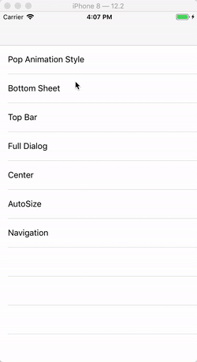

# HWPopController

<p style="align: left">
    <a href="https://cocoapods.org/pods/HWPopController">
       
    </a>
    <a href="https://cocoapods.org/pods/HWPopController">
       
    </a>
    <a href="https://cocoapods.org/pods/HWPopController">
       
    </a>
    <a href="https://cocoapods.org/pods/HWPopController">
       
    </a>
    <a href="https://cocoapods.org/pods/HWPopController">
       
    </a>
    <a href="https://cocoapods.org/pods/HWPopController">
       
    </a>
</p>

`HWPopController` can popup `UIViewController` with `multiple animations`, custom pop size in portrait / landscape screen. Popup position can be `top/center/bottom`. And you can define your own popup animations.

## Screen Shot

<div style="text-align: center"><table><tr>
<td style="text-align: center">

</td>
<td style="text-align: center">

</td>
<td style="text-align: center">

</td>
</tr></table></div>

## Features
* Support popup UIViewController.
* Support 12 kinds of pop & dismiss animations.
* Support define your own custom animation for pop & dismiss.
* Support popup at top/center/bottom, and use `positionOffset` to adjust x,y coordinates.

## Compatibility
**iOS 8.0+**, support Objective-C & Swift.

## Installation

HWPopController is available through [CocoaPods](https://cocoapods.org). To install
it, simply add the following line to your Podfile:

```ruby
pod 'HWPopController', '~> 1.0.3'
```

## How to use

1. Create you popup UIViewController.
    1. import HWPopController framework
    2. config `contentSizeInPop` and `contentSizeInPopWhenLandscape`(if you want to support landscape)


    ```Objective-C
    #import "HWPop1ViewController.h"
    #import <HWPopController/HWPop.h>
    @interface HWPop1ViewController ()
    @end
    
    @implementation HWPop1ViewController
    
    - (void)viewDidLoad {
        [super viewDidLoad];
        // Do any additional setup after loading the view.
        self.contentSizeInPop = CGSizeMake(250, 300);
        self.contentSizeInPopWhenLandscape = CGSizeMake(300, 200);
        // build you pop view.
    }
    ```
1. Popup your viewController

    If you want high custom your popup, init HWPopController. Then config the properties what you want.
    
    ```Objective-C
    {
        HWPop1ViewController *pop1ViewController = [HWPop1ViewController new];
        HWPopController *popController = [[HWPopController alloc] initWithRootViewController:pop1ViewController];
        // popView position
        popController.popPosition = HWPopPositionTop;
        [popController presentInViewController:self];
    }
        
     /**
     * pop animation style
     * default is HWPopTypeGrowIn
     */
    @property (nonatomic, assign) HWPopType popType;
    /**
     * dismiss animation style
     * default is HWDismissTypeFadeOut
     */
    @property (nonatomic, assign) HWDismissType dismissType;
    /**
     * animation duration
     * default is 0.2 s
     */
    @property (nonatomic, assign) NSTimeInterval animationDuration;
    
    /**
     * The pop view final position.
     * Default is HWPopPositionCenter
     */
    @property (nonatomic, assign) HWPopPosition popPosition;
    
    /**
     * The offset of the pop view.
     */
    @property (nonatomic, assign) CGPoint positionOffset;
    ```
    
    Quick popup, use the UIViewController category.
    
    ```Objective-C
    HWPop1ViewController *pop1ViewController = [HWPop1ViewController new];
    [pop1ViewController popupWithPopType:HWPopTypeGrowIn dismissType:HWDismissTypeGrowOut dismissOnBackgroundTouch:YES];
    ```

**More details, pls see the Example.**

## Example

To run the example project, clone the repo, and run `pod install` from the Example directory first.

## Author

HeathWang, yishu.jay@gmail.com

## License

**HWPopController** is available under the MIT license. See the LICENSE file for more info.
